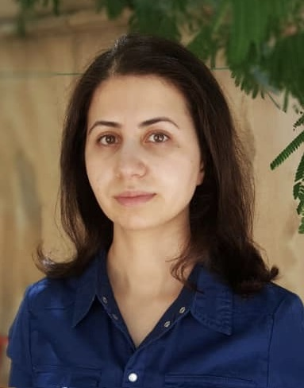

I joined the School of Mathematics as a University Teacher in Statistics in September 2017. Previously, I completed my PhD in Statistics at the University of St Andrews, working on identifiability and parameter redundancy of log-linear models fitted to sparse contingency tables.

$~$

### Education Background

-  PhD in Statistics, University of St Andrews, 2013-17
-  MSc in Mathematical Statistics, University of Tabriz, 2009-11
-  BSc in Statistics, University of Tabriz, 2005-09

$~$

### Research Interests

- Parameter redundancy
- Identifiability problem in statistical models
- Multiple systems estimation
- Statistics and Mathematics pedagogy

$~$

### Contact

Dr. Serveh Sharifi Far 

University Teacher in Statistics

University of Edinburgh

Address: Office 5313 - School of Mathematics - 
James Clerk Maxwell Building - 
King's Building Campus - 
EH9 3JZ

Email: serveh.sharifi@ed.ac.uk

