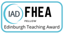

$~$

I am a Fellow of the __[ Higher Education Academy](https://www.advance-he.ac.uk/)__, committed to professionalism in learning and teaching in higher education.  {width=4cm}

$~$

### Some of the courses I have organised:

$~$

- Insights Through Data (2023-24)

Insights Through Data is an MSc course at the Edinburgh Futures Institute. It provides an introduction to the practical aspects of data science via direct interaction with data through statistics, machine learning, and programming in Python. The course runs in a fusion format for on-campus and online students. [Course Catalogue](http://www.drps.ed.ac.uk/23-24/dpt/cxefie11025.htm)

$~$

- Statistical Methodology (2020-21) 

This is a hybrid course covering many of the main concepts of the likelihood-based statistics. The course consists of pre-recorded lecture videos, demonstrations  on RStudio Cloud, digital quizzes and assessments, hybrid workshops, digital synchronous and asynchronous support. [Course Catalogue](http://www.drps.ed.ac.uk/20-21/dpt/cxmath10095.htm)

$~$

- Statistics (2019-20) 

This is a  first course on Statistics that provides an introduction to its basic concepts. The underlying rigorous mathematical framework for several basic and prominent statistical methods are covered. [Course Catalogue](http://www.drps.ed.ac.uk/19-20/dpt/cxmath08051.htm)

$~$

- Applied Statistics (2018-19) 

This course discusses some of the non-parametric statistical methods and provides an introduction to data visualisation. The course was nominated by students for two teaching awards,  __Best Overall Teacher__, and __Best Course__. [Course Catalogue](http://www.drps.ed.ac.uk/18-19/dpt/cxmath10096.htm)

