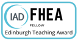

$~$

I am a Fellow of the __[ Higher Education Academy](https://www.advance-he.ac.uk/)__, committed to professionalism in learning and teaching in higher education.  {width=2.5cm}

$~$
$~$

I am Deputy Director of Teaching (Curriculum) in the School of Mathematics, supporting the Director of Teaching in developing the strategic direction of the School’s UG and PGT curricula and ensuring their effective delivery and quality, in collaboration with colleagues leading on different programmes and thematic areas.

$~$

#### Some courses I have organised and taught:

- Insights Through Data (2026-27): This is an MSc course at the Edinburgh Futures Institute. It provides an introduction to the practical aspects of data science via direct interaction with data through statistics, machine learning, and programming in Python. The course runs in a fusion format for on-campus and online students. [Course Catalogue](https://www.drps.ed.ac.uk/26-27/dpt/cxefie11556.htm)

- Statistical Methodology (2020-21): This is a hybrid course covering many of the main concepts of the likelihood-based statistics. The course consists of pre-recorded lecture videos, demonstrations  on RStudio Cloud, digital quizzes and assessments, hybrid workshops, digital synchronous and asynchronous support. [Course Catalogue](http://www.drps.ed.ac.uk/20-21/dpt/cxmath10095.htm)

- Statistics Year 2 (2019-20): This is a  first course on Statistics that provides an introduction to its basic concepts. The underlying rigorous mathematical framework for several basic and prominent statistical methods are covered. [Course Catalogue](http://www.drps.ed.ac.uk/19-20/dpt/cxmath08051.htm)

- Applied Statistics (2018-19): This course discusses some of the non-parametric statistical methods and provides an introduction to data visualisation. The course was nominated by students for two teaching awards,  __Best Overall Teacher__, and __Best Course__. [Course Catalogue](http://www.drps.ed.ac.uk/18-19/dpt/cxmath10096.htm)

$~$

#### Some other courses I have co-taught:

- Representing Data (2022-23): A course on data visualisation for students from different backgrounds at the Edinburgh Futures Institute.
- SMSTC (2018--19):  A video conferencing course for PhD students, covering generalised linear models and simulation.
- Statistical Programming (2018--19): For MSc students in Statistics, covering programming statistical methods in R.
- Mathematics for Natural Sciences (2018-19): For Year 1 Chemistry students, covering introductory probability and statistical concepts.
- Theory of Statistical Inferences  (2017--18): For Year 4 mathematics students, covering advanced theory of statistical inferences.

